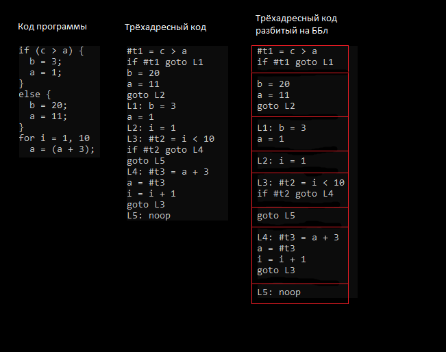

### Разбиение на ББл (от лидера до лидера)
#### Постановка задачи
Реализовать разбиение на базовые блоки от лидера до лидера.
#### Команда
К. Галицкий, А. Черкашин
#### Зависимые и предшествующие задачи
Предшествующие задачи:
* Трехадресный код
* Создание структуры ББл и CFG – графа ББл
Зависимые задачи:
* Def-Use информация и удаление мертвого кода
* Свертка констант
* Учет алгебраических тождеств
* Протяжка констант
* Протяжка копий
* Живые и мертвые перем и удаление мертвого кода
* Построение CFG. Обход потомков и обход предков для каждого базового блока

#### Теоретическая часть
В рамках этой задачи необходимо было реализовать разбиение трехадресного кода на базовые блоки.
Базовый блок – это блок команд от лидера до лидера.
Команды лидеры:
* первая команда
* любая команда, на которую есть переход
* любая команда, непосредственно следующая за переходом

Пример разбиение трехадресного кода на базовые блоки:


#### Практическая часть
Реализовали создание списка операций лидеров:
```csharp
List<BasicBlock> basicBlockList = new List<BasicBlock>(); // список ББл
List<Instruction> temp = new List<Instruction>(); // временный список, для хранения трёхадресных команд для текущего ББл
List<int> listOfLeaders = new List<int>(); Список лидеров
    for (int i = 0; i < instructions.Count; i++) // формируем список лидеров
    {
        if (i == 0) //Первая команда трехадресного кода
        {
            listOfLeaders.Add(i);
        }

        if (instructions[i].Label != null
            && IsLabelAlive(instructions, instructions[i].Label)) //Команда содержит метку, на которую существует переход
        {
            if (listOfLeaders.Contains(i)) // проверка на наличие данного лидера в списке лидеров
            {
                continue;
            }
            else
            {
                listOfLeaders.Add(i);
            }
        }

        if (instructions[i].Operation == "goto"
            || instructions[i].Operation == "ifgoto") //Команда является следующей после операции перехода (goto или ifgoto)
        {
            if (listOfLeaders.Contains(i + 1)) // проверка на наличие данного лидера в списке лидеров
            {
                continue;
            }
            else
            {
                listOfLeaders.Add(i + 1);
            }
        }
    }
```

Заполнение списка базовых блоков:

```csharp
int j = 0;
for (int i = 0; i < instructions.Count; i++) // заполняем BasicBlock
{   //Заполняем временный список
    temp.Add(new Instruction(instructions[i].Label,
                                instructions[i].Operation,
                                instructions[i].Argument1,
                                instructions[i].Argument2,
                                instructions[i].Result));

    if (i + 1 >= instructions.Count
        || i == listOfLeaders[((j + 1) >= listOfLeaders.Count ? j : j + 1)] - 1) // Следующая команда в списке принадлежит другому лидеру или последняя команда трехадресного
    {
        basicBlockList.Add(new BasicBlock(temp)); //Добавляем ББл
        temp = new List<Instruction>(); //Создаем новый пусток список
        j++;
    }
}
```

Результатом работы является список базовых блоков, состоящий из команд трехадресного кода разбитых от лидера до лидера:
```csharp
	return basicBlockList;
```

#### Место в общем проекте (Интеграция)
Используется после создания трехадресного кода. Необходим для разбиение трехадресного кода на базовые блоки.
```csharp
/* Main.cs */
var threeAddrCodeVisitor = new ThreeAddrGenVisitor();
parser.root.Visit(threeAddrCodeVisitor);
var threeAddressCode = threeAddrCodeVisitor.Instructions;
var optResult = ThreeAddressCodeOptimizer.OptimizeAll(threeAddressCode);
var divResult = BasicBlockLeader.DivideLeaderToLeader(optResult);
```
#### Тесты
В тестах проверяется, что для заданного трехадресного кода разбиение на ББл возвращает ожидаемый результат:
```csharp
[Test]
public void LabelAliveTest()
{
    var TAC = GenTAC(@"
            var a, b, c;
            goto 3;
            a = 54;
            3: b = 11;
            ");


    var expected = new List<BasicBlock>()
            {
                new BasicBlock(new List<Instruction>(){new Instruction("3", "", "", "goto", "")}),
                new BasicBlock(new List<Instruction>(){new Instruction("54", "", "", "assign", "a")}),
                new BasicBlock(new List<Instruction>(){new Instruction("11", "3", "", "assign", "b")}),
            };
    var actual = BasicBlockLeader.DivideLeaderToLeader(TAC);

    AssertSet(expected, actual);
}

[Test]
public void LabelNotAliveTest()
{
    var TAC = GenTAC(@"
            var a, b, c;
            goto 4;
            a = 54;
            3: b = 11;
            ");


    var expected = new List<BasicBlock>()
            {
                new BasicBlock(new List<Instruction>(){new Instruction("4", "", "", "goto", "")}),
                new BasicBlock(new List<Instruction>(){new Instruction("54", "", "", "assign", "a"),
                                new Instruction("11", "3", "", "assign", "b")}),
            };
    var actual = BasicBlockLeader.DivideLeaderToLeader(TAC);

    AssertSet(expected, actual);
}

[Test]
public void OneBlockTest()
{
    var TAC = GenTAC(@"
var a, b, c;
a = 54;
b = 11;
");


    var expected = new List<BasicBlock>()
            {
                new BasicBlock(new List<Instruction>(){new Instruction("54", "", "", "assign", "a"),
                                new Instruction("11", "", "", "assign", "b")}),
            };
    var actual = BasicBlockLeader.DivideLeaderToLeader(TAC);

    AssertSet(expected, actual);
}
```