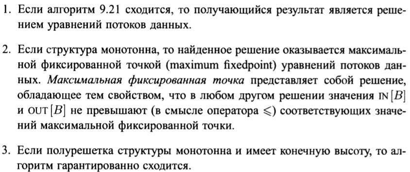

### Итерационный алгоритм в обобщённой структуре
#### Постановка задачи
Реализовать итеративный алгоритм в обобзенной структуре.
#### Команда
К. Галицкий, А. Черкашин
#### Зависимые и предшествующие задачи
Предшествующие задачи:
* Построение CFG. Обход потомков и обход предков для каждого ББл
Зависимые задачи:
* Вычисление передаточной функции для достигающих определений композицией передаточных функций команд
* Активные переменные
​* Доступные выражения
* Передаточная функция в структуре распространения констант
* Достигающие определения
​* Итерационный алгоритм в структуре распространения констант


#### Теоретическая часть
В рамках этой задачи необходимо было реализовать обобщенный итерационный алгоритм.
Входы итерационного алгоритма:
* Граф потока данных с помечеными входными и выходными узлами
* Направление потока данных
* Множество значений V
* Оператор сбора ∧
* Множество функций f где f(b) из F представляет собой передаточную функцию для блока b
* Константное значение v вход или v выход из V, представляющее собой граничное условие для прямойй и обратной структуры соответсвтвенно.
Выходы итерационного алгоритма:
* Значения из V для in(b) и out(b) для каждого блока b в CFG


Алгоритм для решения прямой задачи потока данных:
2. 
Алгоритм для решения обратной задачи потока данных:
1. 
Служит для избежания базового итеративного алгоритма для каждой структуры потка данных используемой на стадии оптимизации.
Его задача вычисление in и out для каждого блока как ряд последовательных приближений. А так же его использование предоставляет ряд полензных свойств приведенных ниже:
3. 

#### Практическая часть
Реализовали класс выходных данных:
```csharp
public class InOutData<T> : Dictionary<BasicBlock, (T In, T Out)> // Выходные данные вида (Базовый блок, (его входы, его выходы))
   {
       public override string ToString()
       {
           var sb = new StringBuilder();
           sb.AppendLine("++++");
           foreach (var kv in this)
           {
               sb.AppendLine(kv.Key + ":\n" + kv.Value);
           }
           sb.AppendLine("++++");
           return sb.ToString();
       }
   }
```

Указываем вид прохода алгоритма:
```csharp
public enum Pass { Forward, Backward }
```

Создали интерфейс оператора сбора:
```csharp
public interface ICompareOperations<T>
{
    // пересечение или объединение
    T Operator(T a, T b);

    bool Compare(T a, T b);  // Сравнение множеств

    // Lower = Пустое множество\ кроме обратной ходки
    T Lower { get; }
    // Upper = Полное множество, все возможные определения
    T Upper { get; }

    (T, T) Init { get; }  // Функция инициализации начальными значениями
}
```

Создали интерфейс передаточной функции:
```csharp
public interface ITransFunc<T>
{
    T Transfer(BasicBlock basicBlock, T input);
}
```

Реализовали алгоритм:
```csharp
public class GenericIterativeAlgorithm<T>
{
    readonly Func<ControlFlowGraph, BasicBlock, List<BasicBlock>> getNextBlocks;
    readonly Pass type;

    public GenericIterativeAlgorithm(Pass _type)  // определение вывова необходимой функции для каждого прохода
    {
        type = _type;
        if (_type == Pass.Forward)
            getNextBlocks = GetParents;
        else if (_type == Pass.Backward)
            getNextBlocks = GetChildren;
    }

    public GenericIterativeAlgorithm()
    {
        getNextBlocks = GetParents;
    }

    public InOutData<T> Analyze(ControlFlowGraph graph, ICompareOperations<T> ops, ITransFunc<T> f)
    {
        if (type == Pass.Backward) return AnalyzeBackward(graph, ops, f);

        var data = new InOutData<T>();
        foreach (var node in graph.GetCurrentBasicBlocks())
            data[node] = ops.Init;

        var outChanged = true;  // Внесены ли изменения
        while (outChanged)
        {
            outChanged = false;
            foreach (var block in graph.GetCurrentBasicBlocks())  // цикл по базовым блокам
            {
                var inset = getNextBlocks(graph, block).Aggregate(ops.Lower, (x, y) => ops.Operator(x, data[y].Out));  // Применение оператора сбора для всех блоков
                var outset = f.Transfer(block, inset);  // Прмиенение передаточной функции

                if (!(ops.Compare(outset, data[block].Out) && ops.Compare(data[block].Out, outset)))  // Сравнение на равенство множеств
                {
                    outChanged = true;
                }
                data[block] = (inset, outset);  // Запись входов и выходов дял определенного блока
            }
        }
        return data;
    }

    public InOutData<T> AnalyzeBackward(ControlFlowGraph graph, ICompareOperations<T> ops, ITransFunc<T> f){
        var data = new InOutData<T>();

        foreach (var node in graph.GetCurrentBasicBlocks())
            data[node] = ops.Init;

        var inChanged = true;// Внесены ли изменения
        while (inChanged)
        {
            inChanged = false;
            foreach (var block in graph.GetCurrentBasicBlocks()) // цикл по базовым блокам
            {
                var outset = getNextBlocks(graph, block)
                    .Aggregate(ops.Lower, (x, y) => ops.Operator(x, data[y].In)); // Применение оператора сбора для всех блоков
                var inset = f.Transfer(block, outset);  // Прмиенение передаточной функции

                if (!ops.Compare(inset, data[block].In)) // Сравнение на равенство множеств
                {
                    inChanged = true;
                }
                data[block] = (inset, outset); // Запись входов и выходов дял определенного блока
            }
        }
        return data;
    }
```

Вспомогательные функции:
```csharp
List<BasicBlock> GetParents(ControlFlowGraph graph, BasicBlock block) =>
    graph.GetParentsBasicBlocks(block).Select(z => z.Item2).ToList(); // Вернуть родитлей блока

List<BasicBlock> GetChildren(ControlFlowGraph graph, BasicBlock block) =>
    graph.GetChildrenBasicBlocks(block).Select(z => z.Item2).ToList(); // Вернуть детей блока
```

#### Место в общем проекте (Интеграция)
Используется для вызова итерационных алгоритмов в единой структуре.
```csharp

            /* ... */
            var iterativeAlgorithm = new GenericIterativeAlgorithm<IEnumerable<Instruction>>();
            return iterativeAlgorithm.Analyze(graph, new Operation(), new ReachingTransferFunc(graph));
            /* ... */
            /* ... */
            var iterativeAlgorithm = new GenericIterativeAlgorithm<HashSet<string>>(Pass.Backward);
           return iterativeAlgorithm.Analyze(cfg, new Operation(), new LiveVariableTransferFunc(cfg));
           /* ... */

```
#### Пример работы
Исходный код программы:
```csharp
public void LiveVariableIterativeTest()
        {
            var TAC = GenTAC(@"
var a,b,c;

input (b);
a = b + 1;
if a < c
	c = b - a;
else
	c = b + a;
print (c);"
);

            var cfg = new ControlFlowGraph(BasicBlockLeader.DivideLeaderToLeader(TAC));
            var activeVariable = new LiveVariableAnalysis();
            var resActiveVariable = activeVariable.ExecuteThroughItAlg(cfg);
            HashSet<string> In = new HashSet<string>();
            HashSet<string> Out = new HashSet<string>();
            List<(HashSet<string> IN, HashSet<string> OUT)> actual = new List<(HashSet<string> IN, HashSet<string> OUT)>();
            foreach (var x in resActiveVariable)
            {
                foreach (var y in x.Value.In)
                {
                    In.Add(y);
                }

                foreach (var y in x.Value.Out)
                {
                    Out.Add(y);
                }
                actual.Add((new HashSet<string>(In), new HashSet<string>(Out)));
                In.Clear(); Out.Clear();
            }

            List<(HashSet<string> IN, HashSet<string> OUT)> expected =
                new List<(HashSet<string> IN, HashSet<string> OUT)>()
                {
                    (new HashSet<string>(){"c"}, new HashSet<string>(){ "c" }),
                    (new HashSet<string>(){"c"}, new HashSet<string>(){"a", "b"}),
                    (new HashSet<string>(){"a", "b"}, new HashSet<string>(){ "c" }),
                    (new HashSet<string>(){"a", "b"}, new HashSet<string>(){"c"}),
                    (new HashSet<string>(){"c"}, new HashSet<string>(){ }),
                    (new HashSet<string>(){ }, new HashSet<string>(){ })
                };

            AssertSet(expected, actual);
        }
```
В тестах проверяется использование итерационных алгоритмов в обобщенной структуре и результаты совпадают с ожидаемыми.
